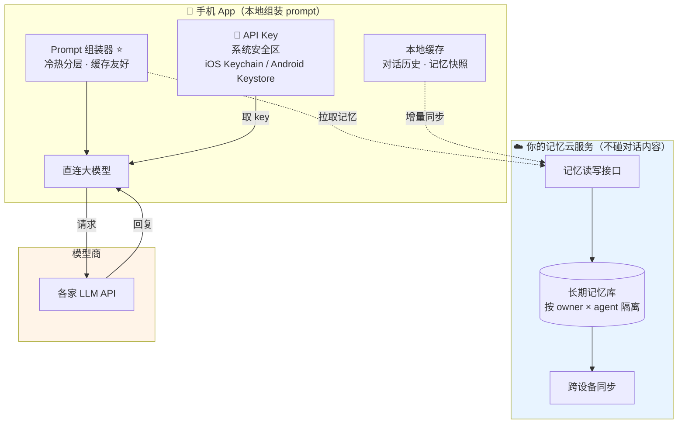

# Yuki初雪 · 架构修订（BYOK 轻模式）v1.1

> **本文修订 v1.0**。v1.0 假设"我养服务器、我出模型钱"，你现在的定位是：**用户自带 API key，我只做 App 外壳 + 记忆长期化 + 缓存优化，语音砍掉**。这不是小调整，它改变了成本结构和整个技术重心。
>
> **数据来源**：GitHub 官方 API 实测（2026-09-24）。星数、语言构成、许可证均为实测值。

---

## 一、先回答你的问题：有没有现成的？

**没有能直接拿来用的整机，但拆开看每一块都有现成的——缺口恰好就是你的机会。**

| 你要的能力 | 有现成的吗 | 具体是哪个 | 许可证 | 缺口 |
|---|---|---|---|---|
| 手机 App（iOS + Android）+ 自带 key | ✅ **有** | `oriveo/oriveo` | ⚠️ AGPL-3.0 | 没有角色、没有记忆 |
| 自定义人设（角色卡） | ✅ 格式有 | SillyTavern 格式 + `kwaroran/Risuai` | ⚠️ AGPL / GPL-3.0 | 要自己实现解析 |
| 长期记忆 | ✅ 有 | `vibeinging/MemMe`、`vmDeshpande/Arcon`、`vinayakajith/mnemo`、`mem0ai/mem0` | ✅ Apache-2.0 | 都是库/其他形态，不是手机 App |
| **手机 App + 角色卡 + 记忆 三位一体** | ❌ **没有** | — | — | **👈 这是你的产品位** |
| 缓存命中率优化 | ❌ **没有专门项目** | 这是实现细节，没人做成独立项目 | — | **👈 这是你的技术护城河** |

---

## 二、三个最值得你读源码的项目

### 1. `oriveo/oriveo` —— 最接近你形态的"壳"（253★）

实测语言构成：**Swift 9.27M + Kotlin 8.91M + TypeScript 8.48M**。

这组数字说明它是**真的原生三端**——iOS 用 Swift、Android 用 Kotlin、Web 用 TypeScript，不是套壳。官方简介明确写着支持 OpenAI / Anthropic / Gemini / OpenRouter / DeepSeek 等十多家 + 任意兼容端点，本地优先、可自托管、**无账号**。

**它是你"壳"的最佳参考**：如何做多模型适配、如何管理用户的 key、如何做本地优先的架构，全在这。

**但它的致命缺口**：它是个**通用聊天客户端**——没有角色卡、没有长期记忆、没有关系状态。它证明"BYOK 手机客户端"这个壳是能做出来的，也反过来说明**没人做过带灵魂的版本**。

⚠️ 两个警告：**AGPL-3.0**（抄代码做联网服务会强制你开源自己）；**2026-09-03 才创建**，很新，成熟度未知。

### 2. `vibeinging/MemMe` —— 伴侣记忆层（46★，Apache-2.0）

⚠️ **这个项目独立验证了我 v1.0 里的一个设计判断。** 它的 README 原文：

> *"Local long-term memory for AI pets. Remember the owner. Keep each pet relationship separate. Stay on the device."*

它的 API 长这样（README 实测代码）：

```rust
AddOptions::new("owner-001").agent_id("momo")
```

**`owner_id` + `agent_id` 双键**——正是我 v1.0 里说的"记忆必须按 (用户 × 角色) 两个维度隔离"。同一个 owner 对不同 agent、不同 owner 对同一个 agent，都是独立的关系。这不是我一个人的推理，是一个独立项目的实测设计。

技术栈：Rust 核心 + SQLite 单文件 + VexDB-Lite，有 npm 包 `@wjmwjmwb/memme`。Apache-2.0，**可放心借鉴**。

**它的缺口**：它走的是"**记忆留在设备上**"（offline-first、单个 SQLite 文件）。你要做的是"记忆长期化**服务**"（云端、跨设备），这个差异要你自己补——但它把"数据模型"和"关系隔离"这两件最容易做错的事给你趟平了。

### 3. `kwaroran/Risuai` —— 角色扮演的另一个实现（1,691★）

TypeScript + Tauri 桌面应用，"Make your own story. User-friendly software for LLM roleplaying"。功能很全（角色卡、多模型、MCP）。

**它的价值**：当 SillyTavern 的角色卡格式有歧义时，看它怎么实现的——两个独立实现能帮你确认"格式的真实约定"。

⚠️ **GPL-3.0**，同样传染。

---

## 三、你选的模式，逼出一个必须现在就定的问题

你要"用户自带 key" + "我提供记忆服务"。这两件事放在一起，**立刻撞上一个矛盾**：

> 你的服务端要帮用户组装 prompt、调 LLM，就必须拿到他的 key；
> 但用户凭什么把 key 交给你保管？

只有两条路，**它们导出的架构完全不同**：

### 方案 A：key 存你的服务端（代理模式）
```
手机 → 你的服务端（存 key，组装 prompt，调 LLM）→ 大模型
```
- 好处：手机端薄，逻辑都在服务端，好更新
- 代价：**用户必须信任你保管他的 key**；**对话内容全经过你** → 你等于在提供 AI 生成服务，**内容责任和合规风险全落你头上**

### 方案 B：key 只存手机（客户端直连）⭐ 推荐
```
手机 App ──(本地组装 prompt，本地直连)──→ 大模型
   │
   └──(只同步记忆)──→ 你的记忆云服务（不碰 key，不碰对话内容）
```
- **这才精确匹配你说的"我只提供软件服务和记忆长期化"**——服务端只管记忆的读写，从不经手对话
- 你**不出 LLM 流量费**（用户自己付给模型商）
- 你**不承担内容责任**——内容不经过你、不在你这儿存
- 隐私最好，这本身就是对用户的说服力（"我们看不到你和她的任何一句话"）
- 🎯 **并且只有方案 B 才可能把缓存优化做到极致**——因为 prompt 组装在你自己手里，格式完全可控（见下一节）

**方案 B 的代价**：手机端要承担 prompt 组装逻辑。但对你这个产品，这是优点不是缺点——缓存优化必须精确控制 prompt 的字节结构，放服务端反而隔着网络难做。

---

## 四、"提高缓存命中率"——没有现成项目，因为这是你的护城河

我确认了：GitHub 上**没有任何项目专门做"伴侣类 App 的 prompt 缓存优化"**。因为它是工程细节，不是独立产品。但这恰恰意味着——**做好了就是你的差异化**。

### 4.1 先分清两个"缓存"

| | 是什么 | 影响谁 | 优先级 |
|---|---|---|---|
| **LLM prompt 缓存** | 模型商对"重复前缀"给的折扣 | **用户的 API 账单**（直接省钱） | 🎯 主战场 |
| 本地缓存 | 消息历史/记忆库缓存在手机 | 网络往返、响应速度 | 次要 |

你说的"提高缓存命中率"，我判断是指第一个。

### 4.2 铁律：缓存的单位是"前缀",一个字节变了就全失效

主流模型商都提供 prompt 缓存，但机制要求一致：
- **OpenAI**：自动前缀缓存，相同前缀超过一定长度自动命中
- **Anthropic**：要显式用 `cache_control` 标记缓存断点，读缓存的价格远低于正常输入
- **DeepSeek**：自动 context caching，命中后输入价格大幅下降
- **Gemini**：隐式 + 显式两种
- 阿里、智谱等国内厂商也有 context cache 开关

> 具体折扣倍率以各家最新文档为准，我不给可能过期的数字——**上线前要对每家做实测**。

**共同的铁律**：缓存认的是**前缀**。只要前缀有一个字节变了，从变化点往后全部失效，缓存归零。

### 4.3 大多数项目的做法，注定缓存命中率很低

一般项目的 prompt 是这么拼的：

```
[人设] + [今天时间戳] + [向量检索出的记忆，每次不同] + [最近对话]
```

看出问题了吗？
- **时间戳**——每分钟都在变，它后面的一切全部失效
- **向量检索出的记忆**——每次检索结果、排序都不同，插在 prompt 中间 → 后面的对话历史全部缓存失效

**这是这个品类的通病**：记忆做得越"智能"，缓存命中率越低，用户的账单越贵。

### 4.4 解法：把长期记忆切成"冷热两层"

```
┌─────────────────────────────────────────────┐
│ 【稳定前缀】字节级不变 → 吃满缓存           │
│   ① 人设卡（她是谁）                        │
│   ② 核心档案（固化的长期记忆：你的名字、    │
│      生日、她的说话习惯——变化频率极低，     │
│      更新时整块重写，不逐条追加）           │
└─────────────────────────────────────────────┘
┌─────────────────────────────────────────────┐
│ 【动态后缀】每次都变 → 不吃缓存，但量小     │
│   ③ 本次检索到的记忆（放这里，不能放前面）  │
│   ④ 最近几轮对话                           │
│   ⑤ 当前时间/状态（放最后一行，绝不往前放） │
└─────────────────────────────────────────────┘
```

**四个必须遵守的纪律**：
1. **时间戳永远放最后**——它是"缓存杀手"，放前面会毁掉后面所有缓存
2. **动态检索的记忆放后缀**——RAG 结果天然每次不同，它不配待在前缀里
3. **核心档案"整块重写"而非"逐条追加"**——追加会让前缀长度不断变化，破坏一致性
4. **人设卡保持字节稳定**——不要每次渲染时插入变量

**这套设计带来的效果**：一段固定不变的前缀（人设 + 核心档案，往往上千 token）在每次请求里都能命中缓存，而变动的部分（最近对话）本来就短。**用户的 API 账单能显著下降**——这就是你给"自带 key 的用户"提供的真实价值：**用我的 App，你的 key 花得更少。**

### 4.5 一个要避开的坑：语义缓存不适用于这个场景

有些项目会做"语义缓存"（相似问题直接返回缓存的答案）。**对伴侣类产品这是错的**——她每次回复都应该是独一无二的，返回缓存答案会立刻显得机械、露馅。

"缓存命中率"在这个场景里，**只该指 prompt 缓存，不该指回复缓存**。别走岔。

---

## 五、修订后的架构（方案 B）



**这张图和你 v1.0 看到的那张最大的区别**：对话内容**完全不经过你的服务端**。你只提供两条线——手机端那个"缓存友好的 prompt 组装器"，和云端那个"按 (用户×角色) 隔离的记忆库"。

---

## 六、许可证清单（决定你能抄什么）

| 项目 | 许可证 | 能不能抄代码 |
|---|---|---|
| `SillyTavern/SillyTavern` | AGPL-3.0 | ❌ 只能学**格式**，不能抄代码 |
| `oriveo/oriveo` | AGPL-3.0 | ❌ 同上，但可以学架构思路 |
| `kwaroran/Risuai` | GPL-3.0 | ❌ 传染性 |
| `vibeinging/MemMe` | Apache-2.0 | ✅ 可商用借鉴 |
| `vmDeshpande/Arcon` | Apache-2.0 | ✅ |
| `mem0ai/mem0` | Apache-2.0 | ✅ |
| `moeru-ai/airi` | MIT | ✅ 最宽松 |

**一句话规则**：AGPL/GPL 的项目只能"看思路"，不能"抄代码"。Apache/MIT 的可以放心用。

---

## 七、这个模式带来的额外好处：合规风险大幅下降

v1.0 里我列了"AI 备案""内容审核"两条风险。**转成方案 B 后，这两条基本消失**：

- 你**不生成**内容（模型是用户自己接的）
- 你**不存储**对话内容（记忆服务只存提取出的"记忆条目"，不存原始对话）
- 你**不运营** AI 服务，你运营的是"一个带记忆功能的客户端 + 一个人个记忆库"

**这不代表完全没风险**——App 上架仍要过审，记忆库里的内容仍是你的责任范围（用户可能把违规内容沉淀成记忆）。但相比"你自己跑模型、存所有对话"，风险是数量级的下降。

---

## 八、修订后的路线

| 阶段 | 做什么 | 验证标志 |
|---|---|---|
| **一** | 手机 App + BYOK 多模型对话。**先不含记忆** | 你能填自己的 key，跟她说 50 轮不崩人设 |
| **二** | 角色卡（人设）导入 + 本地缓存 | 换一张角色卡，她性格立刻变 |
| **三** | 记忆云服务 + (owner×agent) 隔离 | 换台手机登录，她还记得你 |
| **四** | 冷热分层的 prompt 组装器 | **实测缓存命中率**，对比优化前后的 API 账单 |

**阶段四才是你的护城河**，但必须等前三阶段跑通——因为缓存优化要建立在稳定的 prompt 结构上。

---

## 九、下一步

我建议的下一步有两条路，你选：

**A. 继续读源码**——重点读 `oriveo`（壳怎么做）和 `MemMe`（记忆数据模型怎么设计）。半天时间，能把"壳"和"记忆"两块的坑摸清。

**B. 直接开工阶段一**——搭 Flutter 壳 + BYOK 多模型对话的最小可用版。先跑起来，边做边验证。

如果选 B，我建议第一件事是**写一个探针脚本**：拿两三个主流模型的 API，实测"前缀命中缓存后，账单到底降多少"。这个数字是你整个产品价值的量化基础，也是你日后向用户证明"用我的 App 更省钱"的唯一依据——**不能靠推测，必须实测**。
