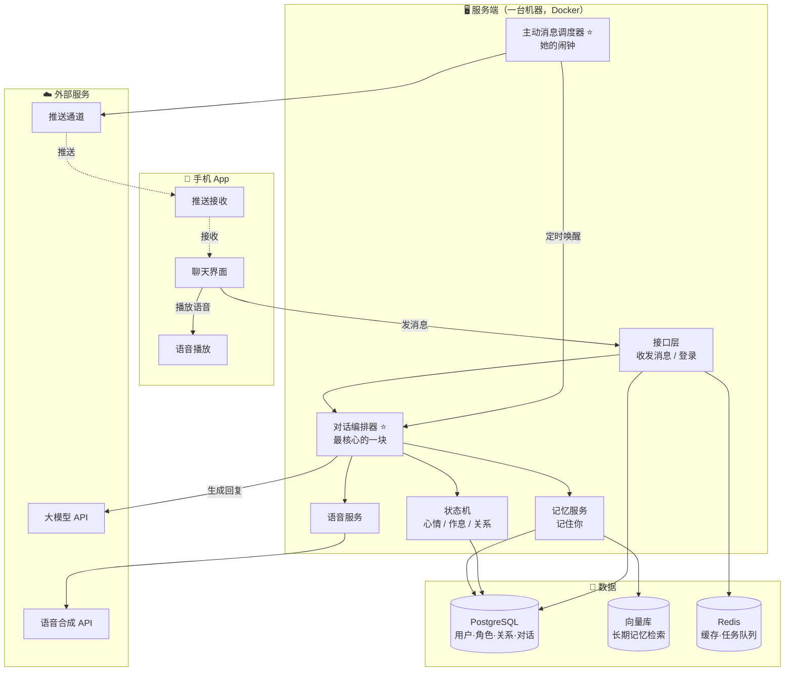
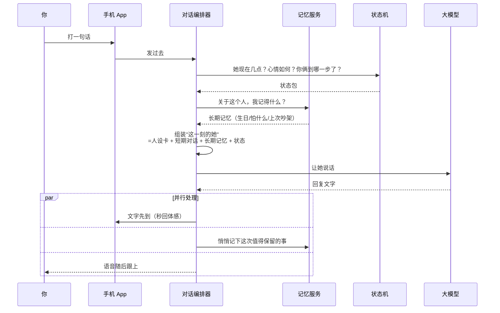

# Yuki初雪 · 架构框架设计（v1.0）

> **前置**：本文基于你已拍板的四个方向——① 手机 App（iOS/Android）② 文字 + 语音 ③ 给一群朋友用 ④ 长期档案 + 她会主动找我。
>
> **v0.1 的调研结论**（开源七块零件、四路流派、许可证坑）见同目录 `研发方向与架构框架_v0.1.md`，本文不重复。

---

## 一、四个答案锁死了什么

先把你的选择翻译成硬约束，后面所有设计都从这四条长出来：

| 你的选择 | 它锁死了什么 |
|---|---|
| 手机 App | 大脑（大模型）必须在云上——朋友不会为谈恋爱装显卡。**必须要服务端。** |
| 文字 + 语音 | 需要语音合成；**但没有语音识别**（她听你说话这件事不做，省掉一块） |
| 给一群朋友用 | **多用户**：每人一个账号、各自独立的她。但**不是收费产品**，所以不需要计费/风控/客服体系 |
| 长期档案 + 主动找我 | 需要长期记忆库 + **服务端有个"闹钟"**，到点自己判断该不该给你发消息 |

**由此推出三个决定性判断：**

1. **规模决定架构复杂度**。"一群朋友" = 十到几十人。这个量级**一台服务器 + Docker 就够，绝不要上微服务/K8s**——那是给百万用户准备的，你现在上它只会把自己拖死。
2. **多用户的隔离维度是"两个人"**：记忆和关系进度必须按 **(哪个用户, 哪个角色)** 两个维度分开存。Alice 和 Yuki 的关系进度，跟 Bob 和 Yuki 的关系进度，是两条独立的线。这是整个数据模型的地基。
3. **主动消息是这个产品的灵魂，也是最烧钱的功能**。它是唯一一个"你不在，她还在动"的部分——但每一次主动出击都要花钱调模型，还要过推送这一关。

---

## 二、整体架构



**注意图中标 ⭐ 的两块**：`对话编排器` 和 `主动消息调度器`。前者是这个产品的技术核心（所有零件在这里汇合），后者是这个产品的灵魂（她不在你身边时依然存在）。

---

## 三、一次对话的完整旅程（含记忆回写）



**两个设计要点**：

- **文字先到，语音后到**。语音合成要花 1-3 秒，如果等语音一起返回，你会盯着屏幕干等。先出文字让你秒回，语音跟上——体感天差地别。
- **记忆回写是"旁路"**（图中 `par` 并行分支）。不能让它拖慢回复。它是"事后记账"，不是"实时必经"。

---

## 四、"她会主动找我"——这一块单独讲

这是你四个选择里最特别的一个，也是最容易被做砸的一个。它的机制是：

```mermaid
flowchart LR
    A[⏰ 调度器每 N 分钟醒来] --> B{该给谁发消息？}
    B -->|判断依据| C[距上次对话多久]
    B -->|判断依据| D[她的作息：现在是她的凌晨吗]
    B -->|判断依据| E[关系阶段：刚认识不该太主动]
    B -->|判断依据| F[今天已经主动过几次了]
    C & D & E & F --> G[选中一批用户]
    G --> H[为每人走一遍<br/>对话编排器]
    H --> I[生成一句"她主动说的话"]
    I --> J[走推送通道发到手机]
```

**四个必须有的刹车**（否则会变成骚扰或烧钱机器）：
1. **频率上限**——每人每天最多主动 N 次（建议起步 1-2 次）
2. **作息感知**——她的"睡觉时间"不发
3. **关系阶段**——刚认识的人，她不该太热情
4. **安静时段**——深夜不发（也是给你省钱）

**技术上的坑（必须提前知道）**：国内 Android 没有统一的推送通道，FCM 用不了。你要么逐家接华为/小米/OPPO/vivo 的推送，要么用聚合服务（个推/极光）。iOS 走 APNs 相对简单。这是"主动消息"落地的真实门槛，不是技术难点但很磨人。

---

## 五、技术选型

每一行都给了"为什么"，理由比结论重要：

| 层 | 选型 | 为什么选它 |
|---|---|---|
| **手机端** | **Flutter** | 一套代码跑 iOS + Android，省一半人力。动画能力强，二期上立绘不用换框架。**风险**：Live2D 在 Flutter 上的生态不如原生成熟，二期可能需要"Flutter 壳 + WebView 承载立绘"的混合方案，到时候再评估 |
| **服务端** | **Python + FastAPI** | 记忆库 `mem0` 和语音克隆 `GPT-SoVITS` 都是 Python——同一语言栈省掉跨语言胶水。FastAPI 天然支持流式输出（做"逐字跳出"的体感） |
| **主数据库** | **PostgreSQL** | 存用户、角色、关系进度、对话历史。关系型数据用关系型库，天经地义 |
| **长期记忆** | **pgvector 插件** | 直接嵌在 PostgreSQL 里，**省一个独立组件**。Artemis 用 Qdrant 是因为它跑本地要极致性能，你这个规模 pgvector 绰绰有余 |
| **缓存 / 任务队列** | **Redis** | 会话热数据 + 调度器的任务队列 |
| **大模型** | **国内 API（DeepSeek / 通义 / 智谱），后期可换** | ⚠️ 关键约束：**这个品类需要"角色扮演不崩人设"的能力**，不是所有模型都擅长。选型时要专门测"连续 50 轮不跳出角色" |
| **语音合成** | **一期用云 TTS API，二期再考虑自建** | 自建 `GPT-SoVITS` 要 GPU，一个月几百上千的固定成本。一期用云 API 按量付费，跑通了再决定值不值得自建 |
| **部署** | **一台云服务器 + Docker Compose** | 十到几十人，别犹豫，一台机器足够 |

**一个明确的反建议**：不要一上来就上 Kubernetes、微服务、消息中间件全家桶。你的规模用不上，它们只会让你在"部署"上耗掉本该花在"她说话像不像人"上的时间。

---

## 六、这张账单必须先看清

"给一群朋友用"意味着**费用由你出**（除非改成大家分摊）。按 **10 个活跃用户**、每人每天 50 条对话估算：

| 项目 | 用量估算（月） | 便宜方案 | 贵方案 |
|---|---|---|---|
| 大模型（纯文字） | 约 1500 万 tokens | 国内 API：**约 15-40 元** | GPT-4o 级：**约 300-400 元** |
| 语音合成 | 约 150 万字符 | 云 TTS：**约 150-450 元** | — |
| 服务器 + 数据库 | 1 台 | **约 50-100 元** | — |
| **合计** | | **约 250-600 元/月** | **约 500-950 元/月** |

**三个从这张表里读出来的事实：**

1. **语音比大脑贵，而且贵得多**。上表里语音的钱和大模型是一个量级甚至更高。所以"每条回复都配语音"这个决定，直接翻倍你的成本。**建议：语音做成可选，或者只对"重要的话"配语音**（比如主动找你的消息配语音，日常闲聊只给文字）。
2. **模型选型差 20 倍**。国内 API 和 GPT-4o 级差 20 倍成本。对这个场景，国内模型足够用——省钱的钱可以拿去做更多人的语音。
3. **省钱的最大杠杆是"少说话"**。主动消息的频率上限不只是防骚扰，也是防烧钱。第二档"每天主动 1 次"对比"每天主动 10 次"，成本差 10 倍。

---

## 七、落地路线图

**别一次做完。** 建议分三阶段，每阶段结束都有能跑起来给你朋友看的东西：

### 阶段一：能聊天（MVP，先证明"她说话像人"）
跑通：App 界面 → 服务端 → 大模型 → 回复。**这段不接语音、不接记忆、不接主动消息。**
- 交付标志：你能跟她说 50 轮，她不崩人设、不跳出角色
- 为什么先做这个：如果模型连"像人"都做不到，后面的记忆和语音都是白搭

### 阶段二：她记得你（长期档案 + 关系状态）
接入：记忆库 + 状态机。开始把"值得记住的事"写进长期档案，下次聊天时取出来。
- 交付标志：隔一天再聊，她主动提起你昨天说过的事
- 这是"人机恋"和"聊天机器人"的真正分界，也是你最该押注的地方

### 阶段三：她活着（语音 + 主动消息）
接入：语音合成 + 主动消息调度器 + 推送通道。
- 交付标志：早上你没找她，她先给你发了一条
- 为什么放最后：这两块都依赖前两阶段跑通，且都是成本大头，验证完再上更稳

---

## 八、风险与合规（必须提前知道）

| 风险 | 说明 |
|---|---|
| **📱 App 上架** | iOS 上架要求内容审核机制；Android 各应用商店对"AI 情感陪伴"类目审核严格。**给朋友用可以先走内测分发（TestFlight / 直接发安装包）绕开上架**，这是推荐的起步方式 |
| **🔞 内容边界** | 情感陪伴类很容易滑向灰色内容。开源项目 KouriChat 特意在简介里回避腾讯系平台，说明这个品类的合规敏感度。**技术上线前要定好内容边界策略** |
| **🤖 AI 备案** | 国内提供 AI 生成内容服务有备案要求。自用/小范围内测风险低，但一旦"给一群朋友用"且对外，需要评估 |
| **💰 费用失控** | 没有用量上限的话，一个朋友疯狂聊天能把你一个月预算烧穿。**必须有每用户每日用量上限** |
| **🔒 隐私** | 用户会跟她说很多私密的事。存储加密和"用户能删除自己的数据"要做 |

---

## 九、下一步该做什么

方向和技术骨架已经清楚，但**在写第一行代码前，我建议再做一件事**：挑 `airi` 和 `Artemis` 这两个最接近的开源项目，真正读一遍它们的源码。

理由：本文的零件划分来自仓库简介和元数据（v0.1 文档已声明这个边界）。而"记忆怎么存、状态机怎么写、上下文怎么组装"这些**最决定成败的细节，只有读源码才知道别人踩过什么坑**。花半天读代码，可能省掉你两周的试错。

读完就可以进入阶段一，开始写代码。
