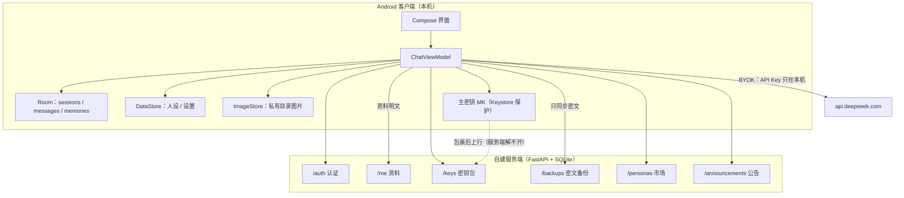
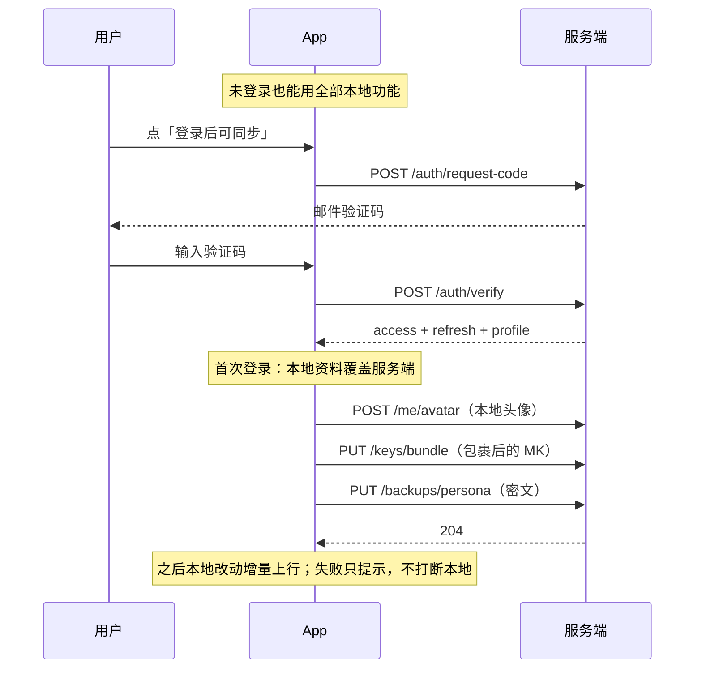

# 后端与「我的」页设计 v1.0

> **写给下一个实现者**（人或 agent）。本文自包含，不引用任何"之前说过"的东西。
>
> **状态**：设计定稿、**未实现**。撰写日期 2026-09-27。
> **依据**：`人机恋app开发文档.md` 的 §10（云存储加密）、§21（账号管理）、§22（关于/致谢）、
> §32（认证流程）、§33（登录过渡）、§38（人设市场）、§39（我的界面）、§44（账号管理界面）。
>
> ⚠️ **本文不是照抄文档**。用户明确授权「你也不一定非要按她的来，你自己也要有想法」，
> 而文档那套设计建立在四个**本项目没有**的依赖上（见下节）。本文按项目实际重做。

---

## 零、为什么需要这一版（文档假设与项目实际的差距）

| 文档的假设 | 本项目实际 | 影响 |
|---|---|---|
| Hilt（`hiltViewModel()`） | **无 Hilt**，手写 `AndroidViewModel` | 所有 §32/§39 的代码示例不能直接用 |
| WorkManager（`@HiltWorker`） | **无 WorkManager**，应用级协程（先例：记忆提取） | 后台任务换承载方式 |
| UCrop（图片裁剪库） | **无第三方图片库** | 头像裁剪要么自己做，要么改成"圆形显示 + 中心裁切" |
| OSS 预签名直传 | **无 OSS、无任何服务端** | 上传目标待定（见 §5.3） |
| AsyncImage（Coil） | **无 Coil** | 头像加载走自研（`ImageStore` + `produceState`） |

**所以本文的定位是**：把文档的**意图**（用户有账号 → 资料可跨设备 → 能进市场）
翻译成本项目能施工的形态，并明确标出我（agent）与文档不同的主张。

---

## 一、范围和现状

### 1.1 现状（as-is，全部可复核）

- 客户端直连 DeepSeek，**BYOK**：API Key 只在这台设备（`AppSettings.apiKey` → SharedPreferences）。
- 会话/消息在 Room；人设/设置在 DataStore（`Store`）。
- **没有任何网络请求指向我们自己的服务器**（唯一的网络出口是 `api.deepseek.com`）。
- 「我的」页（`MainTabs.ProfileTab`）现在是：本地头像+昵称（`UserProfile`）、
  Token 命中统计、编辑资料、设置入口。
- 头像链路已在 v0.20.0 打通：`ImageStore` → 私有目录 → `YukiAvatar`/`UserAvatar` 渲染。

### 1.2 非目标（本项目写死的边界，别自作主张加回来）

- **不做多模型**（只 DeepSeek）、**不做商业化**、**不做 iOS**。
- **API Key 永不上云**。这是铁律，不是"暂时不做"——见 §4.4。

---

## 二、三条主张（与文档不同的地方，附理由）

### 主张 1：**账号是可选增强，不是使用门槛**

文档 §32 把认证放在流程前端（启动 → 检查登录 → 未登录去登录页）。
我主张：**不登录也能用全部本地功能**；账号只解锁"跨设备 / 市场 / 云备份"。

理由：
1. 这是一个**纯自用/公益**的伴侣 App（用户明确），强制注册会让第一批用户直接流失；
2. 当前所有功能都是本地的，账号对它们**零贡献**——为它挡在门口，是拿可用性换数据；
3. 本地优先的架构下，"登录"天然是**按需触发**的（想换手机了、想发布人设了，才需要）。

落地形态：`我的` 页顶部在未登录时显示「未登录 · 点这里同步到云端」，而不是启动页强制登录。

### 主张 2：**人设与聊天记录上云必须端到端加密，服务端零知识**

文档 §10 有这条，我同意，并且认为它应该**先于**任何云功能落地。

理由：聊天记录是人机恋 App 里**最私密的数据**，没有之一。服务端能读到的版本
一旦因为运维失误/被拖库泄露，伤害不可逆。零知识加密的成本只是"换设备要导出密钥"。

落地形态：
- 主密钥 `MK` 在客户端随机生成（32 字节），**永不离开设备**；
- 上云内容用 `MK` 派生密钥做 AES-GCM 加密，服务端存密文 + nonce；
- `MK` 用用户口令派生的密钥（PBKDF2 / Argon2）包裹后**单独存一条**（"密钥包"），
  换设备时用口令解开。这条是唯一允许服务端持有的加密材料，且它本身是密文。

### 主张 3：**头像与图片走对象存储，但不做"预签名直传"的复杂度**

文档 §2.4 用 OSS 预签名直传。自建后端 + 少量用户的前提下，直接 `multipart` 上传到
自建接口更简单，省掉一套签名逻辑与 OSS 依赖。图已经被压到 256×256（头像）
/ 1440（背景），单张几十 KB，没有直传的必要。

---

## 三、账号体系设计

### 3.1 认证方式：邮箱 + 验证码（不要密码）

| 方案 | 优点 | 缺点 | 结论 |
|---|---|---|---|
| 邮箱 + 密码 | 无外部依赖 | 要处理找回、要存密码哈希（哪怕加盐）、用户要记 | ❌ 自用产品，成本不成比例 |
| 邮箱 + 验证码 | 无密码可泄；实现简单（一张表 + 一次邮件） | 依赖邮件服务 | ✅ **选它** |
| 手机号 + 短信 | 体验好 | 要钱、要实名 | ❌ |
| 第三方登录（GitHub 等） | 省事 | 依赖外部、隐私声明复杂 | ❌ |

⚠️ 参考本项目另一个项目踩过的坑（见 `AGENT_NOTES_用户偏好与项目约定.md`）：
**"服务器未配置邮件服务时注册会死锁"** —— 所以验证码发不出去时，
必须给一条明确出路（提示 + 允许跳过验证进入本地模式），而不是让用户卡死。

### 3.2 令牌

- `POST /auth/verify` 成功后发 **access token（2h）+ refresh token（30d）**；
- 客户端存 `EncryptedSharedPreferences`（androidx.security-crypto）——
  **这是本项目唯一需要新增的加密依赖**，值得（明文存 token 等于把账号送人）；
- refresh 失败（过期/被吊销）→ 静默回落到"未登录"，**不打断任何本地功能**。

### 3.3 邀请码闸门（可选）

自用产品可以加一道 `invite_code`：注册时必须带码，防止被陌生人刷。
码由你在服务端配置，**默认关闭**。

---

## 四、数据模型与迁移

### 4.1 客户端新增

```kotlin
/** 本地资料的"账号化"扩展 —— 现有 UserProfile 加两个字段即可，不推翻重来 */
data class UserProfile(
    val nickname: String = "",
    val avatarPath: String? = null,      // 本地路径（已有）
    val uid: String? = null,             // 新增：登录后由服务端下发
    val avatarUrl: String? = null,       // 新增：服务端地址；有它时优先于 avatarPath
)
```

**为什么不是新建一个 `Account` 类**：`UserProfile` 已经是"我是谁"的答案，
账号只是让这个答案有了远端副本。两个类并存会出现"到底该读哪个"的长期困惑。

### 4.2 迁移路径（零数据丢失）

```
未登录                          登录后
─────────────────────────────   ─────────────────────────────
nickname = "小夏"          →    昵称以本地为准（首次登录时上传覆盖服务端）
avatarPath = /files/av_a.jpg → 上传 → avatarUrl = https://.../av_a.jpg
uid = null                 →    服务端下发 → uid = "u_xxx"
```

**冲突规则**：首次登录时**本地覆盖服务端**（本机已经用了一阵，是本机在用）。
之后的修改双向同步，以 `updatedAt` 新者为准。

### 4.3 服务端表

```sql
users(id, email, nickname, avatar_key, invite_code_used, created_at, updated_at)
verify_codes(email, code_hash, expires_at, used)       -- 5 分钟有效，一次性
refresh_tokens(token_hash, user_id, expires_at, revoked)
key_bundles(user_id, wrapped_mk, kdf_salt, kdf_params) -- 零知识密钥包（§2 主张 2）
backups(user_id, kind, cipher_blob, nonce, updated_at) -- kind: persona|session|memory
published_personas(id, user_id, title, cipher_blob, like_count, view_count, created_at)
```

⚠️ `verify_codes` 的 `code_hash` 存哈希不存明文 —— 本项目另一个项目就因为
"邮箱验证码明文进日志"被清理过一次。

### 4.4 API Key 的位置（重申铁律）

`AppSettings.apiKey` **永远只在本机**。任何接口的上行 payload 里出现它都算缺陷。
同步到云端的内容里如果包含 `AppSettings`，必须**先剔除 apiKey 字段**——
建议在序列化层做白名单，而不是黑名单（后者漏一个字段就是事故）。

---

## 五、接口清单（REST，客户端只依赖这些）

```
POST   /auth/request-code      {email}                  → 204（限流：同邮箱 60s 一条）
POST   /auth/verify            {email, code, invite?}   → {access, refresh, profile{uid,nickname,avatarUrl}}
POST   /auth/refresh           {refresh}                → {access, refresh}
POST   /auth/logout            {refresh}                → 204

GET    /me                                              → {uid, nickname, avatarUrl}
PATCH  /me                     {nickname?}              → {uid, nickname, avatarUrl}
POST   /me/avatar              multipart(file)          → {avatarUrl}

PUT    /keys/bundle            {wrappedMk, kdfSalt, kdfParams}  → 204
GET    /keys/bundle                                     → {wrappedMk, kdfSalt, kdfParams}

PUT    /backups/{kind}         {cipherBlob, nonce}      → 204
GET    /backups/{kind}                                  → {cipherBlob, nonce, updatedAt}

GET    /personas?cursor=                                → {items[], nextCursor}
POST   /personas               {title, cipherBlob}      → {id}
POST   /personas/{id}/like                              → {likeCount}
POST   /personas/{id}/view                              → {viewCount}

GET    /announcements                                   → {items[]}   -- §22 公告/更新日志
```

**约定**：所有错误返回 `{error: {code, message}}`，`message` 是**给人看的中文**，
客户端可以直接展示（本项目一贯要求"失败必须说话"）。

---

## 六、「我的」页设计（§39 的落地版）

### 6.1 结构

```
┌──────────────────────────────────────┐
│              [ 头像 88dp ]            │  ← 有自定义图就显示，否则浅色圆 + 昵称首字
│              小夏                     │  ← UserProfile.nickname，空则「我」
│     已同步 · 2 台设备                  │  ← 未登录时：「未登录 · 点这里同步到云端」
│      [ 编辑我的资料 ]                  │
├──────────────────────────────────────┤
│ Token 用量                            │
│   累计命中      1,234,567 tokens      │
│   累计未命中      234,567 tokens      │
│   缓存命中率          84.0%           │
│   ─────────────────────────────       │
│   ⓘ 命中率越高越省钱。首轮请求 0% 是正常的。│ ← 把"0% 是不是坏了"这个疑问就地答掉
├──────────────────────────────────────┤
│ 云端（未登录时整组显示为「登录后可同步」）  │
│   备份与恢复                      ›   │
│   我的密钥（导出备换机）            ›   │
│   退出登录                        ›   │
├──────────────────────────────────────┤
│ 其他                                  │
│   设置                            ›   │
└──────────────────────────────────────┘
```

### 6.2 与 §39 的四处差异（都有理由）

| 文档 §39 | 本文 | 理由 |
|---|---|---|
| 「我发布的人设」（含 ♡ / 👁） | **删掉**，改为「云端」分组的入口 | 发布是市场功能（§38），没上市场前这一块永远是空的；空列表不如没有。另外文档用了 emoji（♡/👁），与用户「不用 emoji」的硬要求冲突 |
| Token 卡片含「节省金额 / 剩余余额」 | **删掉** | 余额要服务端账户体系；节省金额要一张**会变的价目表**。显示一个可能过期的估算，比不显示更糟。等单价做成可配置项（设置里可改）再算 |
| 无「密钥」入口 | **加「我的密钥」** | 零知识加密的代价就是"换设备要带密钥"。不把这个入口做在明面上，用户换机时会**永久失去**云端数据 |
| 无同步状态 | **加"已同步 · N 台设备"** | 「她记得我」是产品核心，用户需要知道"这些记忆是不是安全的" |

### 6.3 状态与错误

- **离线**：资料页显示本地内容，"云端"分组置灰并注明「无网络」——不弹错。
- **refresh 过期**：静默回落未登录；"云端"分组变成「登录后可同步」，**不打断任何本地功能**（主张 1）。
- **上传失败**：明确一句人话 + 可重试（沿用本项目"失败必须说话"的纪律）。

---

## 七、实施切片（按依赖排序，每片都能独立验证）

> 原则：**每一片都能在不破坏本地功能的前提下上线**。

| 片 | 内容 | 验证方式 | 依赖 |
|---|---|---|---|
| **B0** | 服务端骨架（FastAPI 单文件 + SQLite WAL），只有 `/health` 与 `/announcements` | `curl /health` 200 | 无 |
| **B1** | 邮箱验证码 + `/auth/verify` + 令牌 | 单测：过期码 / 复用码 / 限流 各一条 | B0 + 邮件服务 |
| **B2** | 客户端登录 UI + `EncryptedSharedPreferences` 存令牌 | 真机：登录 → 杀掉重开 → 仍在登录 | B1 |
| **B3** | `/me` + 头像上传（`multipart`），`UserProfile` 加 `uid`/`avatarUrl` | 真机：改名改头像 → 重装 App → 登录后回来 | B2 |
| **B4** | 零知识密钥包 + `/backups` 加密同步 | 单测：加解密往返；真机：**两台设备**互相同步 | B3 |
| **B5** | 人设市场 | — | B4 |
| **B6** | 公告/更新日志（§22） | — | B0 |

**建议从 B0 + B6 起**：两者都不需要登录，能先把"服务端存在且可用"这件事跑通，
且公告功能独立、立刻有用（用户能看到更新日志）。

### 架构图



### 登录与同步时序



---

## 八、风险与未决

| # | 风险 | 缓解 |
|---|---|---|
| 1 | **零知识加密的密钥丢失 = 云端数据永久不可读** | 「我的密钥」入口强制引导导出；文案写明"丢了就找不回来" |
| 2 | 邮箱服务不可用时注册死锁（另一个项目踩过） | 发不出码时给明确出路，允许退回本地模式 |
| 3 | 服务端被拖库 | 只存密文；验证码/令牌存哈希；日志不落明文 |
| 4 | 同步与本地写入竞争 | 同步是**单向增量**（本地 → 云端），冲突时本地优先；不做双向实时合并 |
| 5 | 成本 | 单实例 2C2G 够用（用户已有服务器）；分页 + 限流 |
| 6 | **未决**：备份加密后服务端能否做"增量"？ | 密文分块（按会话）可增量；整库加密则每次全量。倾向**按会话分块** |

## 九、开工前必须确认的两件事

1. **服务器**：是否已有可部署的域名与机器？（本项目另一个项目用 `sy.example.com` + Nginx）
2. **邮箱服务**：用哪家？没有的话 B1 要先做一个"控制台打印验证码"的降级模式（仅开发用）。

---

## 十、与现有代码的接缝（实现时改哪里）

| 要改的 | 位置 | 注意 |
|---|---|---|
| `UserProfile` 加字段 | `data/Models.kt` | 加 `uid` / `avatarUrl`，**不要**新建 Account 类 |
| 头像显示优先远端 | `ui/components/YukiAvatar.kt` | 有 `avatarUrl` 时走网络加载（需自研简单缓存） |
| 新增网络层 | `data/net/`（已有 `ReconnectStrategy` 等） | 与 `DeepSeekClient` **分开**：不同 baseUrl、不同鉴权 |
| 令牌存储 | 新增 `data/SecureStore.kt` | `EncryptedSharedPreferences`；**不要**塞进现有 `Store`（那是明文的） |
| 「我的」页 | `ui/main/MainTabs.kt` 的 `ProfileTab` | 按 §6.1 的结构；云端分组在未登录时置灰 |
| 启动流程 | `MainActivity.kt` | **不动**：不登录也直接进主界面（主张 1） |
